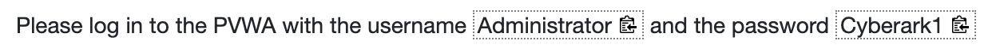

# Markdown Instructions
Markdown is simple markup language most commonly used for documentation.  It allows a plain text document to contain formatting markups that are similar in function, but easier to use than HTML and leaves the text file in a format that is still human readable.  Using a markup language allows for documents to contain rich formatting, but take all style decisions away from the author.  Style choices are configured in the markdown interpreter that will render the document into HTML.  This allows for multiple authors to use consistent formatting choices across all documentation and to work in a file format that is completely platform independent.

## Headings
Use # to denote a heading. You can add more #s to decrease the heading level. Note markdown requires a spae after the #. While some markdown interpreters will render a heading appropriately if the space is omitted, a # without a space may be interpreted as a #hashtag.

```markdown
# Heading 1
## Heading 2
### Heading 3
#### Heading 4
##### Heading 5
###### Heading 6
```
Rendered:
# Heading 1
## Heading 2
### Heading 3
#### Heading 4
##### Heading 5
###### Heading 6
> Note: Some markdown interpreters will render a horizontal line below some headings.  Skytap will not do this.  The PDF may or may not contain this depending on CSS settings.

## Text Formatting
```markdown
**Bold**

*Italic*

***Bold and Italic***

~~Strikethrough~~

`monospaced`
```
Rendered:

**Bold**

*Italic*

***Bold and Italic***

~~Strikethrough~~

`monospaced`

## Lists
### Unordered List
```markdown
- Item 1
  - Sub-item 1
  - Sub-item 2
- Item 2
```
Rendered:
- Item 1
  - Sub-item 1
  - Sub-item 2
- Item 2

### Ordered List
```markdown
1. First item
2. Second item
   1. Sub-item 1
   2. Sub-item 2
```
Rendered:
1. First item
2. Second item
   1. Sub-item 1
   2. Sub-item 2

## Links and Images
### Link
```markdown
[Link text](https://www.cyberark.com)
```
Rendered:

[Link text](https://www.cyberark.com)

### Image
When including images, do not bother resizing them to fit the screen.  Use files that contain the full resolution of the screen capture.  Skytap and the PDF rendering script will resize images to best fit the available space.  Skytap will also allow the user to pop out to fullscreen images that cannot be displayed readably within the lab guide panel.  These fullscreen images will need the maxiumum quality possible.
```markdown

```

Rendered:


## Blockquotes
```markdown
> This is a blockquote.
```
Rendered:
>This is a blockquote.


## Code Blocks
Code blocks are sections of text that represent source code or terminal commands. These will be rendered in an off-color background as indented monospaced text, to appear more like plain text. This makes code much more readable.

### Inline Code
Use backticks to denote code or a command within a line.
```markdown
This line features `Inline code`.
```
Rendered:

This line features `Inline code`.

### Fenced Code Block
Use triple backticks to denote a code block containing multiple lines. After the opening backticks, you can also specify the coding language. Some markdown interpreters will apply the appropriate syntax highlighting for that language.
<pre><code>```C++
#include &lt;stdio.h&gt;

int main() {
    printf("Hello, World!\n");
    return 0;
}
```</code></pre>
Rendered:
```C++
#include <stdio.h>

int main() {
    printf("Hello, World!\n");
    return 0;
}
```

## Tables
To create a table, use pipes (|) to create columns in your plain text. You can use a row of dashes to separate column headers from the rest of the body. 
>Note: Markdown expects a row of column headers and does not always work correctly if that is not supplied. 

Columns do not need to line up as neatly as shown in order to render correctly, however an important goal of markdown language is that the unrendered text still be human readable. Therefore, it is good practice to make tidy tables in the unrendered text.
```markdown
| Header 1 | Header 2 | Header 3 |
|----------|----------|----------|
| Row 1    | Data 1   | Data 2   |
| Row 2    | Data 3   | Data 4   |
```
Rendered:
| Header 1 | Header 2 | Header 3 |
|----------|----------|----------|
| Row 1    | Data 1   | Data 2   |
| Row 2    | Data 3   | Data 4   |

## Horizontal Rule
Triple hyphens (---), asterisks (***), or underscores (___) on their own line will create horizontal lines of various thicknesses.
```markdown
---
***
___
```
Rendered:
---
***

___

## Attachments
You can attach downloadable files. The syntax is the same as any other web link. If you reference a link to your local file system, the Skytap publishing script will upload the file to Skytap and properly reformat the link to allow the user to download the file from Skytap. You could also just reference a link to a downloadable file on any webpage.

```markdown
[Download The Guide](./LabGuide.pdf)
```

Rendered:

[Download The Guide](./LabGuide.pdf)

# Special Extensions for Skytap
Skytap Course Manager has several features that are not directly supported by the markdown language. You can, however, include raw HTML within a markdown file to accommodate those additional features. Unfortunately, that makes the unrendered text file difficult to read in violation of good markdown practice. To fix this, the `md2html.py` script will replace these following markups with the appropriate HTML before passing the file to markdown conversion function.
>Note: The following features will not render appropriately in a standard markdown preview, but will work in both Skytap Course Manager and the PDF output.

## Page Break
Page breaks are necessary in Skytap because the space to display the manual is so small. Skytap tracks progress through the various pages of the lab manual through the "Mark Done and Continue" button it places at the end of every page. Skytap also makes a dynamic table of contents page based on these page breaks. Use frequent page breaks to make the manual more readable and navigable.
```markdown
::: pagebreak :::
```

## Include Files
This will allow you to include the contents of any other file within your document. Use this to break large lab manuals into multiple files.
```markdown
::: include exercise1.md :::
::: include exercise2.md :::
::: include exercise3.md :::
```

or to even include text, sample files, or code.
<pre><code>```python
::: include MyScript.py :::
```</code></pre>

## Copyable Text
To denote text that can be copied from the guide into the Skytap machine by clicking on it, use double carets `^^` around the text. For example:

```markdown
Please log in to the PVWA with the username ^^Administrator^^ and the password ^^Cyberark1^^
```

In Skytap: 

  

## Script and Command Buttons
Script and Command Buttons allow the student to initiate action in the lab environment by clicking on a button in the lab manual.  This could include running a script that sets up the environment to be ready for future steps, or a script that validate previoius work have been completed successfully before allowing the student to move on.  The most convenient way to include a script or command button is to just include the necessary HTML for Skytap.  To understand the HTML, just add a command block in a Skytap manual via the manual editor and then switch to code view to find the HTML.

```html
<p>
	<x-command contenteditable="false" data-activate="false" data-attempts="" data-blocking="" data-command='invoke "build"' data-command-type="system" data-description="This will rerun the provisioning script and attempt to build any missing resources" data-guid="d79aa5b1-cbb2-4a88-b96c-4ef26d3f4938" data-spinner="all" data-target="%{script_vm_host}" data-timeout="0" title="This will rerun the provisioning script and attempt to build any missing resources">Reattempt Provision</x-command>
</p>
```

In Skytap:


#TODO: Info and Warning Blocks

#TODO: Quizzes and other gates