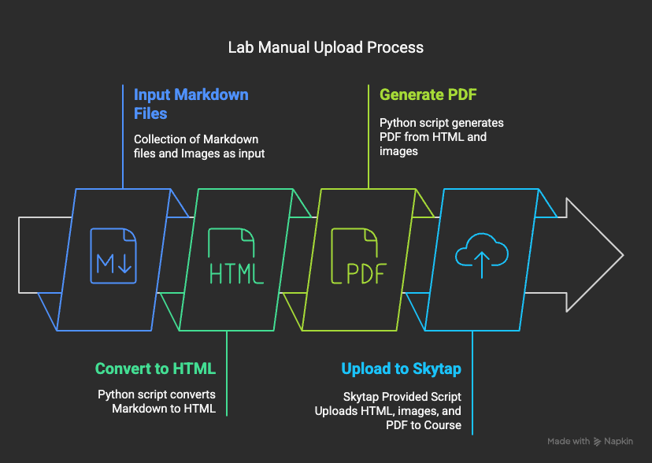

# Skytap Course Manager Lab Manual Template

This repository provides a template for creating lab manuals for Skytap Course Manager in markdown language.

## Purpose
The purpose of this repository is to help you create structured and well-formatted training collateral from simple human readable text files.



## Description of Files and Folders

- **LabGuide.md**: The main markdown file for the lab manual. This file contains the content of the lab manual, including instructions, steps, and placeholders for dynamic content.  You may create other md files to include within the main file, but the conversion scripts expect to start rendering the lab manual in this file.
- **Cheatsheet.md**: A markdown file that provides a reference for markdown syntax and conventions used in the lab manual.
- **readme.md**: This file. It provides an overview of the project, instructions for usage, and a description of the files and folders.
- **md2html.py**: A Python script that converts the markdown file (`LabGuide.md`) to an HTML file (`LabGuide.html`). It also processes inclusions, page breaks, and other Skytap specific features.
- **md2pdf.py**: A Python script that converts the HTML file (`LabGuide.html`) to a PDF file. It also processes placeholders and applies CSS Styles.  It will prompt for a PDF filename on first run and store that filename in (`.pdf_config.yml`) for future runs.
- **html2md.py**: A Python script that converts an HTML file back into a markdown file. You can use this to generate markdown from a Word file saved at HTML.
- **styles.css**: A CSS file that defines the styles for the PDF output. It includes styles for fonts, tables, images, and other elements.
- **skytapvariables.csv**: A CSV file that contains placeholders and their corresponding values. These values are used to replace dynamic Skytap placeholders with sample values when generating the PDF.
- **images/**: A folder to store images used in the lab manual. The images can be referenced in the markdown file using relative paths.
- **publish.sh**: A shell script that runs the entire publication process.  It will call the python scripts to generate the HTML and PDF version of the lab manual, then use the Skytap provided container to upload the HTML and attachments to the Skytap Course Manager Title.
- **course_manual_manager/**: This folder is provided by Skytap and contains the code to upload an HTML manual, and any attachments it references, to a particular Skytap Course Manager Title.  It will prompt you for details on first run and store those details in (`.publish.yml`) for future runs.
-

## Instructions
1. Refer to the [Cheatsheet](./Cheatsheet.md) for instructions on how to author a markdown file.
2. Edit the LabGuide.md to create your lab manual.  You may include images and the contents of other files to build a structured lab manual.
3. Create a local python virtual environment and install the (`requirements.txt`).
    ```sh
    python3 -m venv .venv
    source .venv/bin/activate
    pip install -r requirements.txt
    ```
4. Once you have created your lab manual, run the following script to publish your material:
    ```sh
    ./publish.sh
    ```
    This will publish your lab manual to the specified Skytap Course Manager title and generate the PDF file.

## Useful Tools
To simplify pasting images into markdown files, consider installing the Markdown Sync Image extension in VSCode. This extension allows you to easily paste images directly into your markdown files, and it will handle the image file management for you. You can configure Markdown Sync Image to automatically generate, or prompt you for an image file name when pasting. You can also configure it to automatically put pasted images into the ./images folder for a better organized project.
