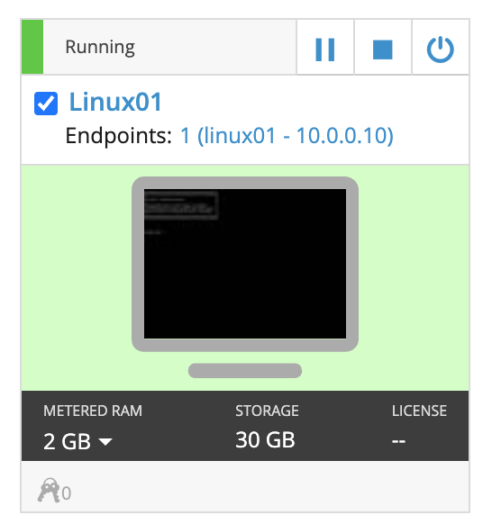
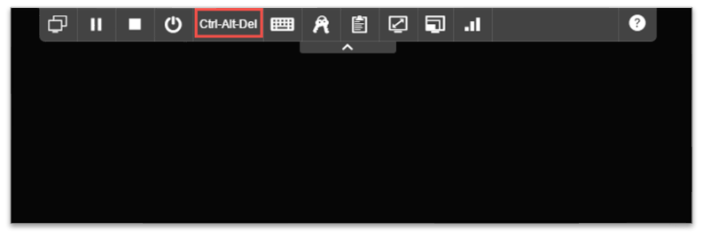
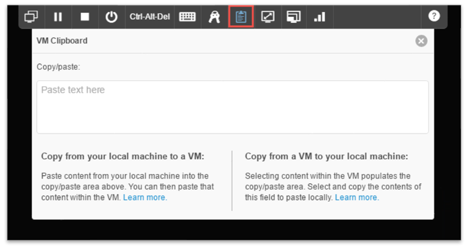
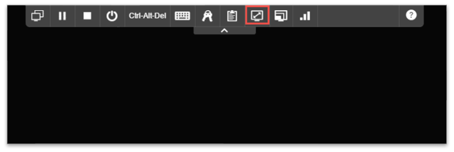
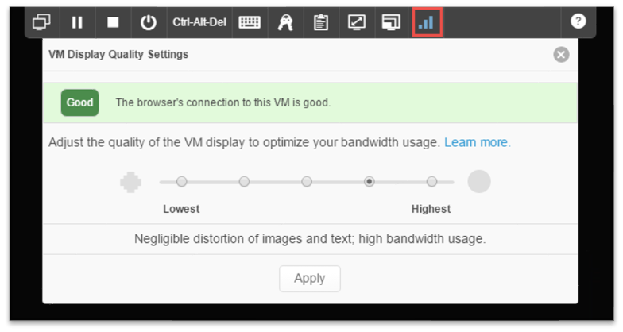
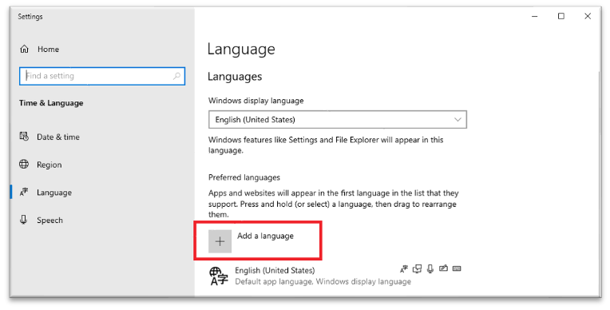
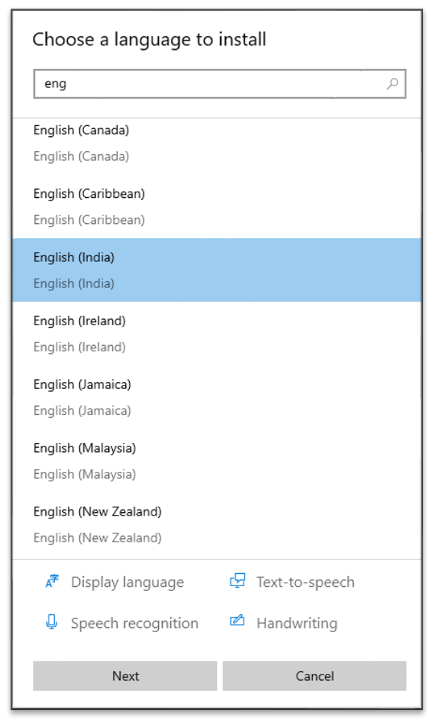

## Using Skytap
Before beginning the exercises, here are a few tips to help you navigate the labs more effectively.  You can refer to the section for International Users for instructions on changing the keyboard.

When you arrive in the lab environment, the machines will have already booted in the correct order to ensure service dependencies are met.  You may notice some machines are not already running, these are rarely-used, resource-intensive machines.  The guide will instruct you to start them when they are needed.
 
::: pagebreak :::

### Connecting to a Virtual Machine
Click on the large monitor icon to connect to a virtual machine with the HTML 5 client.  This will provide a **console** connection to the virtual machine.

  

Use the Ctrl-Alt-Del button on the tool bar to send a Ctrl-Alt-Del to the machine.

  

The clipboard icon will allow you to copy and paste text between your computer and your lab machine.

The full screen icon will resize your virtual screen to adapt to your computer's screen settings to avoid scrolling.

You may need to adjust your bandwidth setting on slower connections.

::: pagebreak :::

### International Users
By default, the lab machines are configured to use a US English keyboard layout.  If you use a machine from a country other than the US, you may experience odd behavior from your lab machines.  The solution is to install the keyboard layout for your keyboard on our lab machines.  Follow the process below to find and configure the correct keyboard layout for your keyboard.

From the Start Menu, go to Settings > Time & Language > Language > Add a language.

  

Select your language.  Click Next.  You can uncheck the options for voice and handwriting and then click Install.

  

>[If you use an alternate keyboard layout (e.g., AZERTY, Dvorak), you can click the options next to your language to install that.  Otherwise, close the Language window.

In the system tray, click ENG, then choose your keyboard layout.  You may switch back and forth between keyboard layouts.  Your instructor may need to switch back to ENG to help you with exercises, so do not uninstall any language options.
 
::: pagebreak :::
